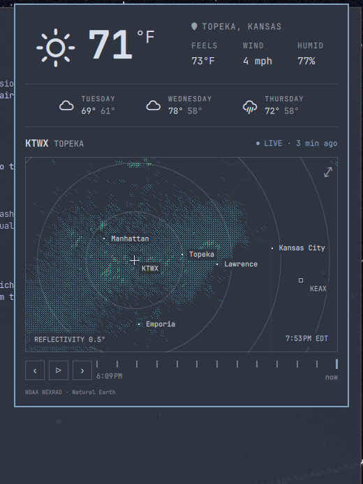

# Skywatch

Weather forecast and live interactive radar, combined into a single Omarchy Quattro bar widget.

One pill in the bar: click it to open a single panel with the **current conditions and 3-day forecast on top**, and the **interactive weather radar below** — scan timeline, playback, a dBZ legend, and expand to the full radar window.



## Install

Skywatch is fully self-contained — the radar engine and UI are vendored in, so no other plugin is required.

```sh
omarchy plugin add https://github.com/dchristensen8/omarchy-skywatch.git --enable
```

On first radar open, the pinned Omastorm engine binary downloads itself and
installs under `~/.local/share/omastorm/bin` (sha256-verified). Configuration
and remembered view stay in `~/.config/omastorm/` and
`~/.local/state/omastorm/`.

## Usage

- **Left-click** the Skywatch pill to open the combined panel: current
  conditions + 3-day forecast on top, interactive radar below.
- **Right-click** the pill to send the current conditions as a notification.
- **Middle-click** the pill to refresh the forecast immediately.
- **Drag the radar map** to pan (it switches to the radar covering where you
  land); **scroll** to zoom. Click the **⤢** (top-right) to expand into the
  full radar window; **⤢** re-opens it when already closed.
- A **dBZ legend** in the map's top-left shows the color scale, from dry
  (light echoes) to wet (intense precipitation).
- Click the location label in the panel to search for a different city.

### Weather

- Current temperature, condition icon, feels-like, wind, and humidity
- 3-day forecast (icon, day name, hi/lo)
- Location auto-detected by IP, or configured via the click-to-search label
- Refresh interval configurable (default 15 min) via the widget settings;
  middle-click refreshes now

### Location sync

The weather panel and the radar share one location (`weather.json`), so
changing it in either surface updates both:

- **Weather → radar** — search a new city in the weather panel and the radar
  re-centers on it.
- **Radar → weather** — pick a place on the radar (search, site picker, or
  "my location") and the forecast follows.

Panning the radar is navigation, not a location change, so it never rewrites
your weather location.

### Home location

Pin a **home** and Skywatch always returns to it. Click the house icon next
to the location label in the panel (hover it for a tooltip):

- **No home set** — a click pins the current location as home.
- **Home set** — a click jumps straight home; a right-click re-pins the
  current location as the new home.

While the panel is open you can browse anywhere — the forecast and radar stay
synced. When you **close** the panel (or reopen it), everything returns to
home. Home is stored in the widget's `home` setting in `shell.json`:

```json
{
  "id": "dchristensen8.skywatch",
  "home": { "name": "Topeka, Kansas", "latitude": 39.0489, "longitude": -95.6780 }
}
```

### Radar

- Live interactive radar (drag to pan, scroll to zoom)
- Timeline scrubber with play/step controls over recent scans
- Status line: LIVE / ARCHIVED and how long ago the sweep was taken
- dBZ legend (top-left) with a dry → wet label
- **⤢** opens the full standalone radar window

## Configure

Weather unit (metric/imperial) follows your locale and country, or can be
overridden in the widget settings. Radar site, location, and playback are
managed inside the radar itself and by the radar config
(`~/.config/omastorm/config.toml`).

## Remove

```sh
omarchy plugin remove dchristensen8.skywatch
```

## Dependencies

- `curl` — weather and geocoding API requests (open-meteo, wttr.in)
- Internet connection for live weather and radar data
- On first use the pinned Omastorm engine binary is downloaded from GitHub
  Releases and verified against its committed sha256

## Credits

Skywatch combines two plugins:

- **Weather** — derived from the Omarchy first-party `omarchy.weather`
  widget (part of [Omarchy](https://github.com/omacom/omarchy), MIT).
  Forecast data from [open-meteo.com](https://open-meteo.com) and
  [wttr.in](https://wttr.in).
- **Radar** — the interactive radar is [Omastorm](https://github.com/wesleygrimes/omastorm)
  by **Wes Grimes** (MIT), vendored into `radar/` (including the engine
  bootstrap) so Skywatch is self-contained. NOAA NEXRAD (US) and EUMETNET
  OPERA (Europe) reflectivity data; basemaps © OpenStreetMap / Natural
  Earth. The vendored source retains its own [LICENSE](radar/LICENSE).

The panel layout that joins the forecast and the radar, plus the home
location and two-way location sync, are original to Skywatch. This project
is MIT — see [LICENSE](LICENSE).